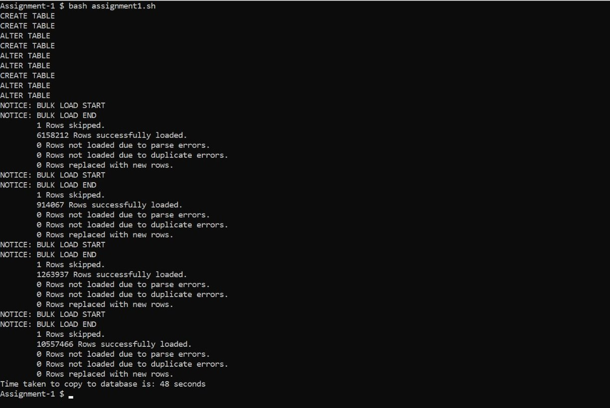

 # Part A: Database Loading

 ## Approach Final

 Made used of pg_bulkload to speed up the copy operation. Made use of the default pg_bulkload operation with parallelize to complete the whole process of creating table, adding constraints and copying data from csv to table in 40-60 seconds on average.

 ## Approach Previous

 Made use of consecutive `CREATE, \Copy, and ALTER` statements to complete the end-to-end creation, copying of csv data to table and adding constraints to database. Average operations completed in around 200-220 seconds.

 ## Initial Approach

 Reduced the number of constraints by making name as the primary key in tables with foreign keys. Also reduced constraints in subreddit table by creating a composite key of `name, display_name` which is referred to by a composite foreign key of `subreddit, subreddit_id` in comments table.

 ## Best Performance Screenshot

 

  ## Important Notes

 I was not able to get permission to run the copy from the CSV files using pg_bulkload. Hence, I have copied the CSV files to `/tmp/`. However, I have accordingly changed the paths in the zip file submissions to `./filename.csv`.


 # Part B: Database Querying for Insights

### Goal

* Perform Queries to obtain insights from the Reddit Pushshift database.
* I have written Queries in PostgreSQL to find answers to the requirements/problem statements to derive insights.

### Queries for Insights:

1. **query1:**
   Write a SQL query to return the total number of comments authored by the user `xymemez`.
   - Your column names MUST be: ‘count of comments’

2. **query2:**
   Write a SQL query to return the total number of subreddits for each subreddit type.
   - Your column names MUST be: ‘subreddit type’, ‘subreddit count’

3. **query3:**
   Write a SQL query to return the top 10 subreddits arranged by the number of comments. Calculate average score for each of these subreddits and round it to 2 decimal places.
   - Your column names MUST be: ‘name’, ‘comments count’, ‘average score’

4. **query4:**
   Write a SQL query to print name, link_karma, comment_karma for users with >1,000,000 average karma in descending order. Additionally, also have a column ‘label’ which shows 1 if the link_karma >= comment_karma, else 0.
   - Your column names MUST be: ‘name’, ‘link karma’, ‘comment karma’, ‘label’
   - You can write this query with both having and where clauses (both will be considered correct and submit only one), however, try doing both just to see the speed difference. (if you do try it) let us know the results in the README along with your theory for why!
   - To fairly compare times between 2 queries, you need to clear the postgres cache! A helpful link: [See and clear Postgres caches/buffers? - Stack Overflow](https://stackoverflow.com/questions/17418325/see-and-clear-postgres-caches-buffers)

5. **query5:**
   Write a SQL query to give count of comments in subreddit types where the user has commented. Write this query for the user `[deleted_user]`.
   - Your column names MUST be: ‘sr type’, ‘comments num’

6. **query6:**
   Write a SQL query to print the datetime (UTC format) of the created time of comments, subreddit name and comments for the user `xymemez` in the subreddit `starcraft`.
   - Your column names MUST be: ‘utc time’, ‘subreddit’, ‘comment’

7. **query7:**
   Write a SQL query to get the 4 most upped submissions (if any) from the 4 oldest under 18 subreddits.
   - Your column names MUST be: ‘submission’, ‘ups’, ‘subreddit’
   - Using posgres functions might be a good idea for this!

8. **query8:**
   Write a SQL query to get the author and ups for the most upvoted and least upvoted comment on reddit.
   - Your column names MUST be: ‘author’, ‘upvotes’
   - Sub-queries or temp tables are a great option for such questions

9. **query9:**
   Write a SQL query to display the number of comments made by the author, `xymemez` according to the utc date arranged in ascending order.
   - Your column names MUST be: ‘date’, ‘count’

10. **query10:**
    Write a SQL query to get the month when reddit was most active along with the 10 top subreddits and the number of posts in the subreddits in that month.
    - Your column names MUST be: ‘month’, ‘subreddit’, ‘count’


### Personal Learning

* I was able to learn and efficiently make use of ```inner joins, group by, extract and order``` functions. 
* I also learnt how to use subqueries.

### Issues

* Queries 7 and 10 took time to understand and implement. 
* Also, converting to UTC without the time-zone differential was an issue.

### Query 4, Having vs where:

* After removing the Postgre cache I find that using the ```where``` clause vs the ```having``` clause is faster as the ```where``` clause will filter the result rows before returning them whereas ```having``` does it afterwards. 
* There is no optimization scope in ```having```.

# Part C: Data Fragmentation through Partitioning

# SQL Partitioning Functions

This repository contains Python functions designed to work with PostgreSQL databases for table creation, data loading, and partitioning using range and round-robin methods.

## Functions Provided

#### 1. `get_open_connection()`

Connects to the PostgreSQL database specified by global variables `username`, `password`, `dbname`, and `host`, and returns the connection object.

#### 2. `load_data(table_name, csv_path, connection, header_file)`

Creates a table with specified name (`table_name`) and loads data from a CSV file (`csv_path`). The table structure is defined using a JSON file (`header_file`) containing column headers and types.

#### 3. `range_partition(data_table_name, partition_table_name, num_partitions, header_file, column_to_partition, connection)`

Partitions data from `data_table_name` into `partition_table_name` using range partitioning based on `column_to_partition`. It creates `num_partitions` partitions, defining boundaries automatically based on the data range.

#### 4. `round_robin_partition(data_table_name, partition_table_name, num_partitions, header_file, connection)`

Partitions data from `data_table_name` into `partition_table_name` using round-robin partitioning. It evenly distributes rows across `num_partitions` tables.

#### 5. `delete_partitions(table_name, num_partitions, connection)`

This function is intended for testing purposes. It aims to delete all partitions created by the user for a given `table_name` and `num_partitions`.

## Setup

To use these functions, ensure you have the following installed:

- PostgreSQL
- Python 3.x
- Required Python libraries: `psycopg2`, `psycopg2.extras`, `json`, `csv`, `math`

Ensure the PostgreSQL server is running and adjust the global variables (`username`, `password`, `dbname`, `host`) in the script to match your PostgreSQL configuration.

## Usage

1. **Data Loading:**
   - Use `load_data()` to create a table and load data from a CSV file.
   
2. **Range Partitioning:**
   - Employ `range_partition()` to partition data based on a specified column into multiple ranges.
   
3. **Round-Robin Partitioning:**
   - Use `round_robin_partition()` to partition data evenly into multiple tables using a round-robin approach.

4. **Deleting Partitions:**
   - For testing purposes, `delete_partitions()` can be used to delete partitions created by the user.

## Notes

- Ensure proper configuration of PostgreSQL and Python environment variables.
- This repository does not handle the installation of additional libraries beyond those listed.

Feel free to explore and adapt these functions for your own database partitioning needs!


# Part D: Insights with BigQuery:

# BigQuery Queries and Analysis


## Queries and Results

### Query 1: Top Subreddits by Average Score and Comment Count

To find the subreddits with the highest average score and more than 1000 comments:

```
SELECT sub, avg_score, comment_count
FROM (
  SELECT string_field_5 as sub, 
    AVG(int64_field_4) as avg_score, 
    COUNT(string_field_1) as comment_count
  FROM reddit_comments.reddit_comments
  GROUP BY sub
)
WHERE comment_count > 1000
ORDER BY avg_score DESC, comment_count DESC
LIMIT 10;
```

## Query 2: Most Controversial Subreddits

To identify the most controversial subreddits based on the proportion of controversial comments and more than 1000 total comments:

```
SELECT sub, all_controversial/all_comments as prop_controversial, all_comments
FROM (
  SELECT SUM(int64_field_3) as all_controversial, 
    COUNT(string_field_1) as all_comments, 
    string_field_5 as sub
  FROM reddit_comments.reddit_comments
  GROUP BY sub
) AS sub_stats
WHERE all_comments > 1000
ORDER BY prop_controversial DESC;
```

# Analysis Results

## Most Active Subreddits
The most active subreddits are also highly popular, often appearing on the front page of Reddit's r/all. Examples include r/T_D and r/PewdiepieSubmissions.

## Maximizing Karma
Subreddits focusing on female-oriented topics like r/SapphoAndHerFriend and r/muacirclejerk tend to offer higher karma potential due to their supportive communities.

## Lowest Average Comment Scores
Subreddits with mundane or niche topics generally have the lowest average comment scores. NSFW subreddits also feature prominently in this category.

### More Insights

- **Most Active Subreddits:** The most active subreddits, such as r/T_D and r/PewdiepieSubmissions, are also highly popular and frequently appear on Reddit's front page.
  
- **Maximizing Karma:** Subreddits focused on female-oriented topics like r/SapphoAndHerFriend and r/muacirclejerk tend to offer higher karma potential due to supportive communities.
  
- **Lowest Average Comment Scores:** Subreddits with mundane topics or niche interests typically have the lowest average comment scores, with some NSFW subreddits also falling into this category.
  
- **Most Controversial Subreddits:** Controversy is prevalent in subreddits discussing sensitive topics like politics, gaming (e.g., r/civclassics), and meta-discussions (e.g., r/announcements).

